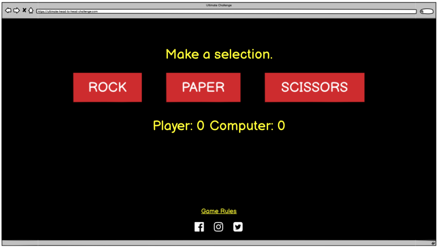
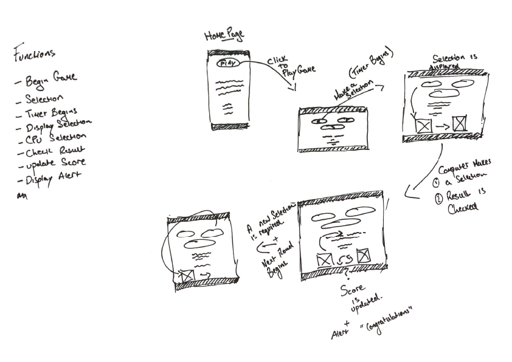

# Purpose of the project

The purpose of this project website is to be a place where a user can come and briefly get there mind of their busy schedule and play a quick game of rock, paper scissors for fun. It’s design is targeted towards users who have vibrant social lives and can instantly relate the theme to an inviting approach.

This website was designed with the user experience in mind and is more visual than text heavy to allow the user to quickly understand what the purpose of the website is for.

# Features

## Navigation Bar

The navigation bar holds the three main sections of the page along with a branded logo to accompany the website. This section is kept quite simple as to allow the user to focus more on the theme of the website without getting overloaded with to much text content.

- __Nav Bar__

  

## Footer Bar

The footer bar holds social media links which when clicked on will take the user to “Ultimate Head to Head Challenge” – Facebook, Twitter, YouTube or Instagram pages.

The icons were designed by myself using Adobe tool kit.

- __Social Icons__

  

## Buttons Selectors

The buttons in the webpage are all designed to a keep a consistent theme throughout the site.

  

  

## Home Page

This home page consists of a play button, a set of icons which catches the users eye instantly and also provides the user with a clear purpose as to what the website is without reading to much descriptions and text.

  

## Game Rules Page

This page is the only page in the website which is text heavy and is needed so. This page is to provide the user with a more detailed explanation on how to play the game if needed.

  

## Game Page

This page is the main page which the user will interact with. It consists of a begin/reset button a brief description on how to start the game and how to increase the level of difficulty to the game, choice selections a timer and a score tracker.

  

# Future Features

This is a website I am very excited to develop further. Some of the features I will be including are:

- On each page I will develop the buttons to actually be more like neon light signs which are attached to the brick wall with fixings and have a light animation like light flickers at times when the user is on a page.
- On the game page mainly I want to include sound effects like a low humming sound to replicate the lights and have custom button clicks for each action the user makes on the page.
- Another feature I would really like to include is options for a choice of different games to choose from which will have their own themes and custom feathers relating to the choice. 

# Wireframes

I chose balsamiq to create some wireframes and to knock out some ideas quickly.

- __Home:__

  

- __Game Page:__

  

  

  

  

# Testing 

I done some extensive user testing with a few people from different age groups that I could get to show my website to. There was some useful feedback received from doing this and I made some adjustments based on this info.

When I began this process I got my users to test the site on a desktop computer as my testers all worked in an office environment. The general feedback was good but when I moved to testing to mobile screens the response was poor. The feedback I got from just over half of my testers said that the interface was too small for the user to have a positive experience with the game and interest was lost quickly due to frustration on using the site in general.

I took this chance to create a more mobile friendly game while still keeping all the features that the testers enjoyed in the desktop test. One of the main issues from the test were:

The user was left confused after clicking play on the home page to then be prompted with a “Begin” and “Reset” button to start the game. This made the user believe the game had already begun. Also then the button was clicked the user was unaware that any function had run.

To address all my feedback I focused on making the site more mobile friendly. I created a script function to swap out the begin and reset buttons on the game page and also to change the button visually to indicate that it had been clicked. Also I added an anchor link to a section of the page which allowed the user to see the icons, timer and keep an eye on the scores in the same frame.

- __Original Placement__

  
  

- __New Placement__

  
  
  

I had used Chrome Dev Tools to check the placement and structure of the HTML elements regularly and make tweaks here and there where needed. In conjunction to Dev Tools I used solid colour background styles to make elements clearer which helped visualise what effects were taking place and what further adjustments I needed to make.

# Validator Testing 

- No errors were found when passing through the official W3C Markup Validation for all the HTML and CSS pages within the website.
- No errors were found when checking the JavaScript through JSHint.

- __Home Page Validation__

  

- __Game Rules Page Validation__

  

- __Game Page Validation__

  

- __CSS Validation__

  

# Deployment

I used GitHub pages to deploy the project and the steps I done are as follows: 

- The site was deployed to GitHub pages. The steps to deploy are as follows: 
  - Open GitHub project repository
  - Navigate to the Settings tab
  - Select pages from the menu on the left hand side
  - Within the source section I selected the Master Branch from the dop down menu.
  - This then provided me the link. 

The live link can be found here - https://ronan-o-murchu.github.io/ultimate-head-to-head-challenge/

# Credits 

## Code 

- Research on how to fix errors with the code was mainly done through W3Schools and Stack Overflow.

## Content 

All the content in this site was adjusted or created using the Adobe suite.

- The image for the background:

    - https://freephotos.cc/storage/preview/path/QX3BawUjn9ov4EMoDxXcrAzDIvjiKuGP8N8cLqFR.jpeg

- The icons:

    - https://www.vecteezy.com/vector-art/691497-rock-paper-scissors-neon-icons

# Acknowledgements

I would like to thank my fellow students, the Code Institute and my mentor Maria Hynes for all the help and guidance to get this far.